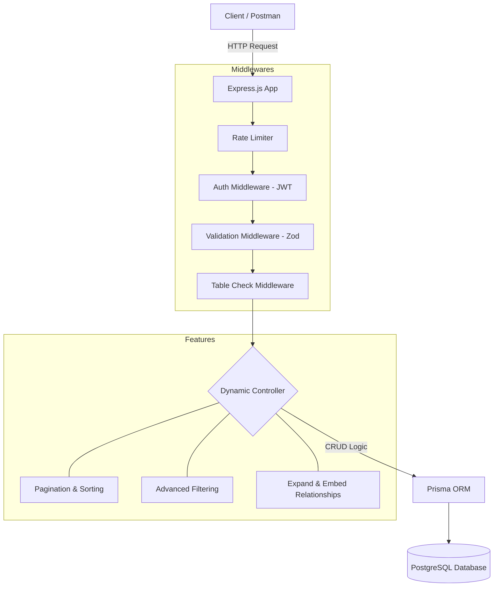

# 🚀 Smart API Hub

Smart API Hub là một hệ thống REST API Platform mạnh mẽ, có khả năng tự động sinh các endpoint CRUD từ file cấu hình `schema.json`. Hệ thống được xây dựng với Node.js, TypeScript và Prisma.

## 🏗 Kiến trúc hệ thống (Architecture)



## 🛠 Tech Stack

- **Runtime:** Node.js (≥ 20)
- **Language:** TypeScript
- **Framework:** Express.js
- **Database:** PostgreSQL
- **ORM:** Prisma
- **Documentation:** Swagger UI
- **Testing:** Vitest + Supertest
- **Containerization:** Docker & Docker Compose

## 🚀 Hướng dẫn cài đặt và chạy (Getting Started)

### 1. Yêu cầu hệ thống

- Node.js ≥ 20
- Docker & Docker Compose (Khuyên dùng)
- PostgreSQL (Nếu chạy local không dùng Docker)

### 2. Cấu hình biến môi trường

Sao chép file `.env.example` thành `.env` và cập nhật các giá trị phù hợp:

```bash
cp .env.example .env
```

### 3. Chạy ứng dụng bằng Docker (Khuyên dùng)

Cách nhanh nhất để chạy toàn bộ hệ thống (App + DB):

```bash
docker-compose up -d --build
```

Hệ thống sẽ khả dụng tại: `http://localhost:3000`

### 4. Chạy ứng dụng Local (Phát triển)

Nếu bạn đã có database và muốn chạy debug:

1. Cài đặt dependency:

```bash
npm install
```

2. Khởi tạo dữ liệu từ `schema.json`:

```bash
npm run data
```

3. Chạy chế độ development:

```bash
npm run dev
```

## 📖 Tài liệu API (API Documentation)

Hệ thống tích hợp sẵn Swagger UI để tra cứu và thử nghiệm API:

- **Swagger UI:** `http://localhost:3000/docs`
- **JSON Spec:** `http://localhost:3000/docs.json`

### Các Endpoint chính:

- `POST /auth/register`: Đăng ký tài khoản.
- `POST /auth/login`: Đăng nhập nhận JWT.
- `GET /health`: Kiểm tra trạng thái hệ thống.
- `GET /:resource`: Lấy danh sách (Ví dụ: `/products`).
- `POST /:resource`: Tạo mới bản ghi.
- `PUT /:resource/:id`: Cập nhật toàn bộ.
- `PATCH /:resource/:id`: Cập nhật một phần.
- `DELETE /:resource/:id`: Xóa bản ghi (Yêu cầu quyền Admin).

## 🧪 Testing

Chạy bộ kiểm thử tự động:

```bash
npm test
```
